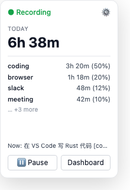
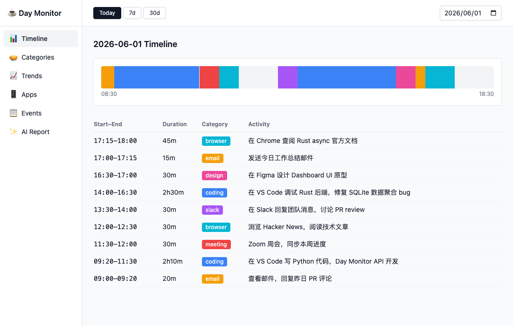
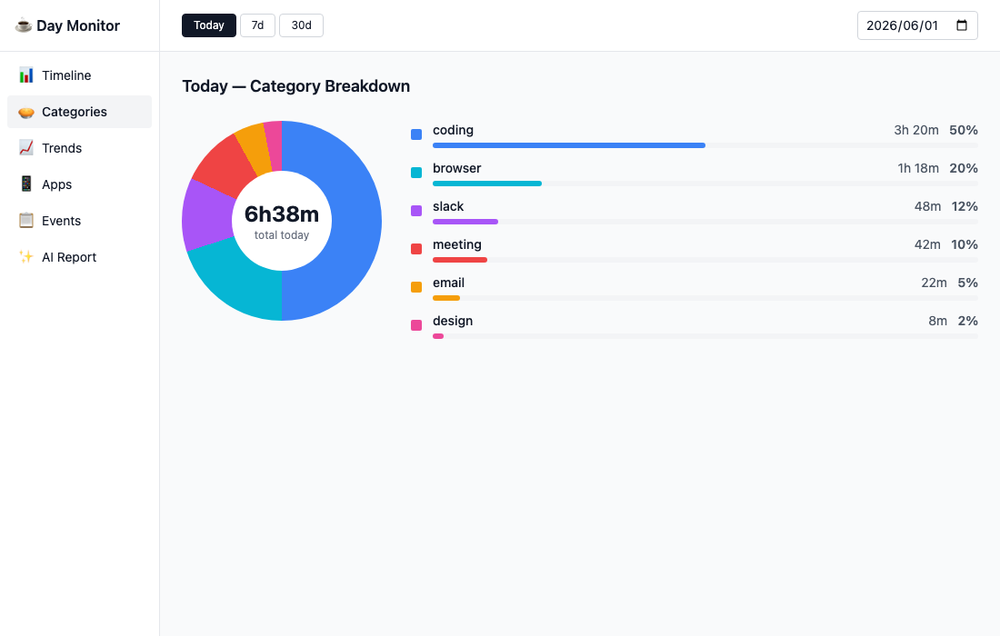
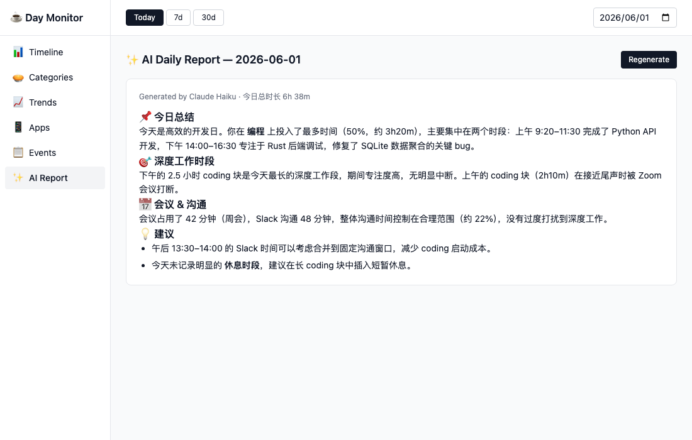

# Day Monitor

> macOS 菜单栏小工具：自动追踪你一天的工作内容，本地分析后生成可视化日报。

每 ~20 秒截一次屏 → Claude Haiku 识别活动类型 → SQLite 记录 → 仪表板展示时间轴/分类/趋势/AI 日报。

[简体中文](#简体中文) · [English](#english)

---

## 简体中文

### 截图预览

**菜单栏 Popover** — 随时查看今日进度，一键暂停或跳转 Dashboard：



**Dashboard · Timeline** — 全天时间轴 + 活动明细表：



**Dashboard · Categories** — 分类占比环形图 + 进度条：



**Dashboard · AI Report** — Claude 生成的每日工作分析报告：



### 这个项目能做什么

- 🕐 **自动追踪时间** — 不需要手动开关 timer
- 🤖 **AI 识别活动** — Claude 看截图直接告诉你"在 VS Code 写代码"或"在微信回消息"
- 📊 **可视化** — 时间轴、分类饼图、跨日趋势、应用排行
- 💰 **可控成本** — 内置 token / 费用统计 + 月度预算上限，避免 API bill 失控
- 🔒 **隐私本地** — 截图不入库（只存 hash 和文字描述），数据全在本机

### 系统要求

- **macOS 12+** (Apple Silicon Mac，arm64-only 当前版本)
- **Anthropic API Key** ([注册](https://console.anthropic.com)，新用户有 $5 免费额度)

### 快速开始

**最简单：[下载预编译 .app](dist/Day-Monitor-0.1.0-arm64.zip)**（见 [INSTALL.md](dist/INSTALL.md)）

**自己编译：**

```bash
git clone https://github.com/yourname/day-monitor
cd day-monitor

# Rust 工具链
curl --proto '=https' --tlsv1.2 -sSf https://sh.rustup.rs | sh -s -- -y

# 前端依赖
cd app && yarn install

# 开发模式
yarn tauri dev

# 打包发布
yarn tauri build
# 产物：app/src-tauri/target/release/bundle/macos/Day Monitor.app
```

### 架构

```
┌────────────────────────────────────────────────┐
│  Day Monitor.app  (Tauri 2 / Rust + React)      │
│                                                   │
│  Menu Bar ──click──> Popover (200×300)          │
│      │                                           │
│      ├──> Dashboard (1100×700, 6 views)         │
│      └──> Settings (interval, budget, etc.)     │
│                                                   │
│  Rust Backend                                    │
│   ├─ tokio loop: capture → hash → analyze       │
│   ├─ /usr/sbin/screencapture (native, no Python)│
│   ├─ Claude Haiku via reqwest                   │
│   └─ rusqlite (~/.day-monitor/monitor.db)       │
└────────────────────────────────────────────────┘
```

### 项目结构

```
day-monitor/
├── app/                          # Tauri app
│   ├── src/                       # React + TypeScript frontend
│   │   ├── popover/               # 菜单栏 popover
│   │   ├── dashboard/             # 6 个视图
│   │   ├── settings/              # 设置窗口
│   │   └── lib/                   # 共享类型 + invoke 包装
│   └── src-tauri/src/             # Rust backend
│       ├── lib.rs                 # 入口、tray、窗口管理
│       ├── loop_runner.rs         # tokio 监控循环
│       ├── capture.rs             # 截屏 + 感知哈希
│       ├── analyze.rs             # Claude API 调用
│       ├── db.rs                  # SQLite 读写
│       ├── stats.rs               # 数据聚合
│       ├── report.rs              # AI 日报生成
│       ├── settings.rs            # 用户配置
│       └── commands.rs            # Tauri commands
├── dist/                          # 发布包（zip + 安装脚本 + 用户文档）
├── docs/                          # 设计文档
├── LICENSE                         # MIT
├── PRIVACY.md                      # 隐私政策
└── README.md                       # 本文件
```

### 配置项

进 Settings 窗口可调：

| 项 | 默认 | 说明 |
|----|------|------|
| 采集间隔 | 20s | 越短数据越细，越长越省钱 |
| 截图分辨率 | 640px | 影响 token 成本（直接 ~50%）|
| 去重阈值 | 12 | 屏幕几乎没变就跳过，0~20 |
| 数据保留 | 30 天 | 老数据自动清理 |
| 月度预算 | 0 (无限) | 超限自动暂停 API 调用 |

### 隐私 & 数据安全

> **一句话：所有记录数据存在你本机，作者拿不到你的任何数据。**

| 数据项 | 存储位置 | 说明 |
|--------|---------|------|
| 截图本身 | ❌ 不存储 | 只在 RAM 里处理，分析完立即丢弃 |
| 感知哈希 | `~/.day-monitor/monitor.db` | 用于去重，无法还原图片 |
| 活动描述 | `~/.day-monitor/monitor.db` | 一句话文字，如"在 VS Code 写代码" |
| API Key | `~/.day-monitor/.env` | 只在本机，从不上传 |
| AI 日报 | `~/Documents/day-monitor/` | 纯本地文件 |

**数据流向：**

```
屏幕截图 → RAM 处理 → Anthropic Claude API（识别活动）→ 文字描述写入本地 SQLite
                 ↓
           截图立即丢弃（不落盘）
```

- **本项目作者** 收不到你的任何数据（无 telemetry，完全开源可审计）
- **Anthropic** 会收到压缩后的截图用于识别，适用其[隐私政策](https://www.anthropic.com/privacy)
- 随时 `rm -rf ~/.day-monitor` 可彻底删除所有本地数据

详见 [PRIVACY.md](PRIVACY.md)。

### 开发 & Mock 数据

本地开发时可以用脚本快速填充 7 天的模拟数据，无需跑满一周：

```bash
# 初始化 mock 数据（不覆盖已有数据）
python3 scripts/seed_mock_data.py

# 重置并重新生成（--days 控制天数）
python3 scripts/seed_mock_data.py --reset --days 30
```

数据写入 `~/.day-monitor/monitor.db`，启动 App 后即可看到有数据的 Dashboard。

### 贡献

欢迎 PR。关注的方向：

- Intel Mac (x86_64) 支持（universal binary）
- Linux / Windows 支持（需要替换 screencapture）
- 多 LLM 后端（OpenAI、ollama 本地模型）
- i18n（当前 prompt 和 UI 都是中文）
- 更细粒度设置（工作时段、低电量暂停）

### 许可证

MIT License — 见 [LICENSE](LICENSE)。

---

## English

### What it does

A macOS menu-bar app that takes a screenshot every ~20 seconds, sends it to Claude Haiku to identify what you're doing, and stores structured activity data locally for daily reports and visualizations.

| Feature | Details |
|---------|---------|
| Auto-tracking | No timers to start/stop — runs in the background |
| AI recognition | Claude sees the screenshot and labels it: "coding in VS Code", "replying on Slack" |
| 6 dashboard views | Timeline · Categories · Trends · App ranking · Events · AI daily report |
| Cost control | Built-in token / cost stats + monthly budget cap |
| Privacy-first | **All data stays on your machine.** Screenshots are never stored — only a one-line text description per capture is written to a local SQLite database. |

### Screenshots


### Privacy

> **TL;DR — your data never leaves your machine. Only screenshots are sent to Anthropic for activity recognition.**

- Screenshots are processed in RAM and **immediately discarded** — they are never written to disk or a database
- The local SQLite DB stores: timestamp + perceptual hash (for dedup) + one-line text description + category
- Screenshots are sent to **Anthropic** (Claude Haiku) over HTTPS. They are **not** sent to the project author
- All activity data lives under `~/.day-monitor/`. `rm -rf ~/.day-monitor` wipes everything
- No telemetry — the project author receives zero data from your usage

See [PRIVACY.md](PRIVACY.md) for full details.

### Requirements

- macOS 12+ (Apple Silicon, arm64)
- Anthropic API key

### Build

```bash
git clone https://github.com/yourname/day-monitor
cd day-monitor/app
yarn install
yarn tauri build
```

### License

MIT.
